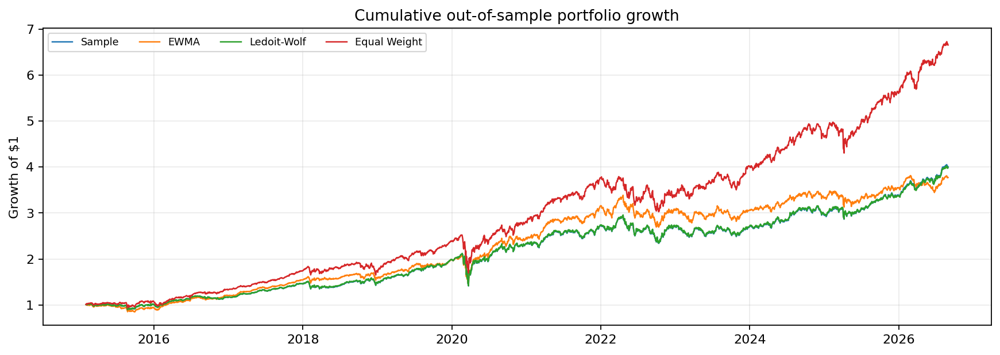
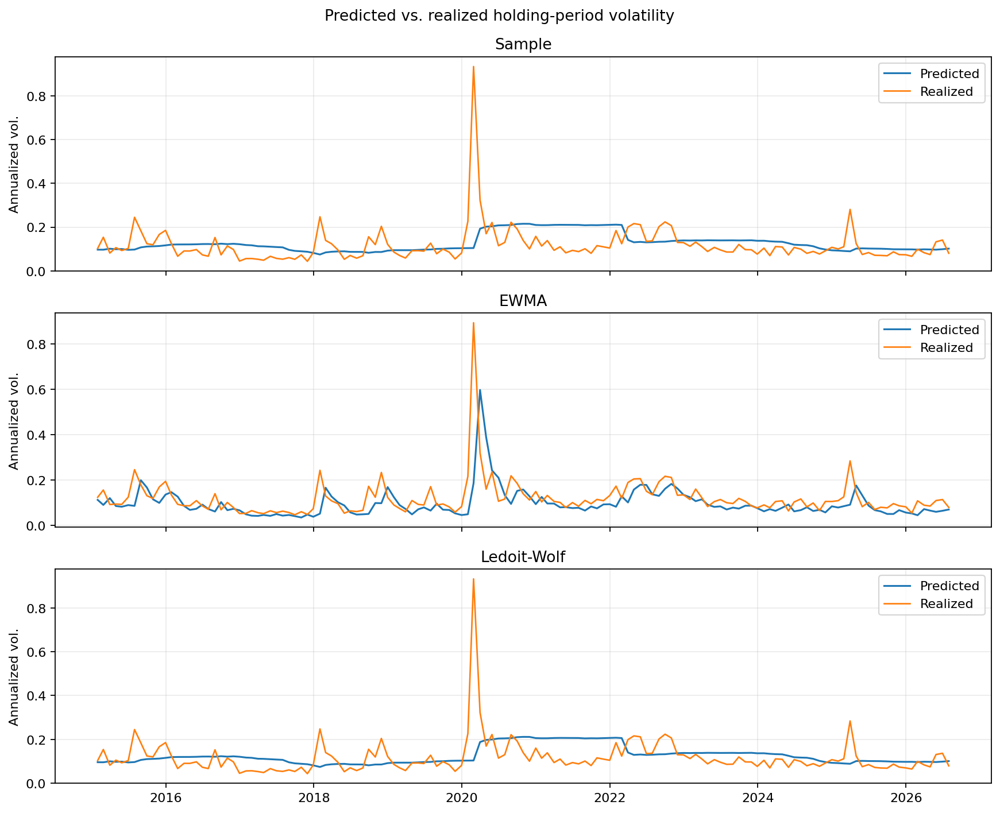
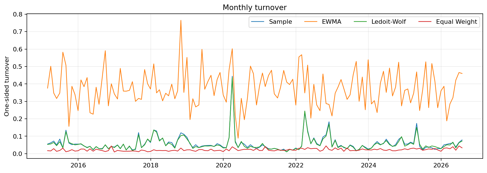
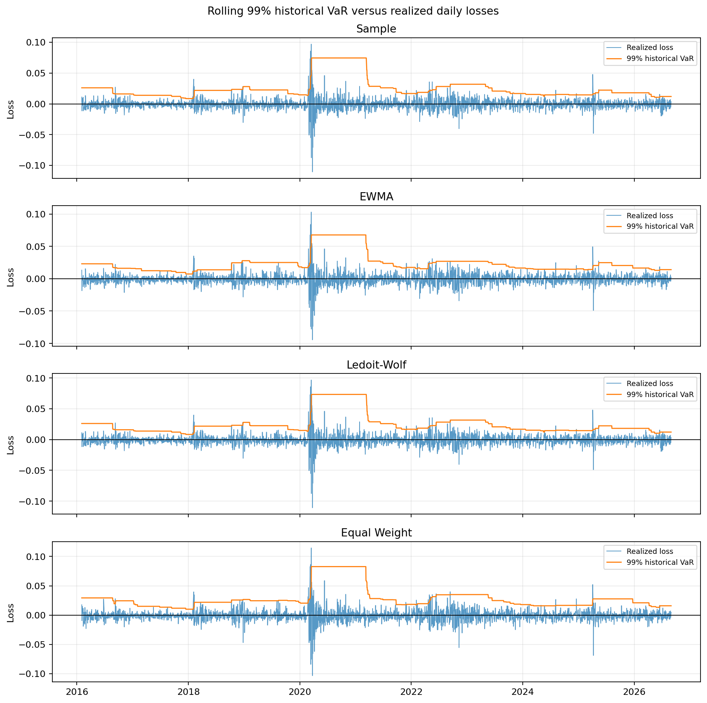

# Cross-Sector Minimum-Variance Portfolio

This study compares three covariance estimators in the same constrained global minimum-variance (GMV) portfolio. It examines realized risk, volatility forecasts, portfolio stability, turnover, and the effect of proportional transaction costs over monthly out-of-sample holding periods.

## Research Question

How does the covariance estimator affect a constrained GMV portfolio when the universe, constraints, and rebalancing schedule are held fixed?

The comparison covers sample covariance, EWMA covariance with \(\lambda = 0.94\), and Ledoit-Wolf shrinkage. Expected returns are excluded so that differences between portfolios come from the covariance estimate.

## Data

The fixed universe contains 22 U.S. large-cap stocks: two stocks from each of the 11 GICS sectors. The ticker and sector mapping is stored in [`data/metadata/universe.csv`](data/metadata/universe.csv).

Daily Yahoo Finance prices cover 2013-01-02 through 2026-08-31. Returns are formed from adjusted closes. The complete-case panel contains 3,435 daily observations for all 22 assets, from 2013-01-03 through 2026-08-31. Missing prices are not forward-filled. Using a fixed, surviving universe introduces survivorship bias.

## Portfolio Construction

At each rebalance, the portfolio solves

$$
\min_w \quad w^\top \hat\Sigma w
$$

subject to

$$
\sum_i w_i = 1, \qquad 0 \leq w_i \leq 0.15, \qquad \sum_{i \in s} w_i \leq 0.25 \quad \text{for each sector }s.
$$

Covariance estimates use the previous 504 daily returns. The benchmark is an equal-weight portfolio over the same assets.

## Rolling Backtest

The backtest rebalances at month-end. For each rebalance, it estimates covariance from returns available at that point, solves new target weights, and holds the portfolio through the next complete month. The 139 holding periods run from 2015-02-02 through 2026-08-31.

Weights drift between rebalances as asset prices move. Turnover therefore compares the new target with the portfolio that actually exists immediately before the rebalance, rather than with the previous target. This is the portfolio used for the next period's trading-cost calculation.

## Results

| Portfolio | Annualized return | Realized volatility | Sharpe | Max drawdown |
|---|---:|---:|---:|---:|
| Sample GMV | 12.76% | 14.59% | 0.897 | -33.24% |
| EWMA GMV | 12.17% | 14.55% | 0.863 | -31.12% |
| Ledoit-Wolf GMV | 12.70% | 14.58% | 0.893 | -33.23% |
| Equal Weight | 17.82% | 16.32% | 1.087 | -32.80% |

The three GMV portfolios had lower realized volatility than Equal Weight. Equal Weight had the highest historical return and Sharpe in this sample. Sample covariance and Ledoit-Wolf produced similar portfolio targets. EWMA produced materially different targets and higher turnover.



### Risk Forecast Evaluation

Each GMV portfolio's ex-ante volatility is compared with realized volatility in the following holding month. EWMA had the lowest overall forecast error, but its negative bias shows systematic underprediction.

| Portfolio | MAE | RMSE | Bias | Underprediction rate |
|---|---:|---:|---:|---:|
| Sample GMV | 5.15% | 9.20% | 0.92% | 30.94% |
| EWMA GMV | 4.14% | 8.31% | -2.28% | 72.66% |
| Ledoit-Wolf GMV | 5.08% | 9.16% | 0.77% | 30.94% |



For a robustness check, high-volatility months are identified using the 75th percentile of Equal Weight realized volatility: 35 of 139 months. All three estimators underpredicted risk on average in those months. EWMA's high-volatility MAE was 9.75%, compared with 8.34% for Sample and 8.39% for Ledoit-Wolf.

Detailed definitions and formulas are in [`docs/methodology.md`](docs/methodology.md).

### Turnover and Transaction Costs

Average monthly one-sided turnover was 5.82% for Sample, 37.54% for EWMA, 5.59% for Ledoit-Wolf, and 2.22% for Equal Weight. EWMA's shorter-memory covariance estimate led to much larger reallocations.



Costs are applied once at each monthly rebalance as \(2 \times \mathrm{turnover} \times \mathrm{bps}/10{,}000\). At 20 bps per dollar traded, the net annualized returns were 12.45% for Sample, 10.18% for EWMA, 12.40% for Ledoit-Wolf, and 17.69% for Equal Weight. EWMA trades more frequently, so transaction costs have a much larger effect on its net performance.

### Tail-Risk Evaluation

Stage 7 evaluates rolling one-day Historical VaR and Expected Shortfall from the saved Stage 4 out-of-sample daily portfolio returns. Each forecast uses the preceding 252 trading days, with no look-ahead. For portfolio return \(r_p\), loss is \(L=-r_p\). Historical VaR is the empirical loss threshold at the chosen confidence level. Expected Shortfall is the average loss at or beyond that VaR threshold. The implementation uses the `higher` empirical quantile convention.

The analysis reports 95% and 99% Historical VaR and Expected Shortfall. The next-day realized loss backtests each VaR forecast. An exception occurs when \(L>VaR\). The Kupiec unconditional coverage test compares observed exception rates with their expected rates.

| Portfolio | Level | Historical VaR | Expected Shortfall | Exception rate |
|---|---:|---:|---:|---:|
| Sample GMV | 95% | 1.28% | 1.96% | 4.77% |
| Sample GMV | 99% | 2.51% | 3.05% | 1.24% |
| EWMA GMV | 95% | 1.27% | 1.95% | 4.89% |
| EWMA GMV | 99% | 2.38% | 2.97% | 1.17% |
| Ledoit-Wolf GMV | 95% | 1.27% | 1.95% | 4.74% |
| Ledoit-Wolf GMV | 99% | 2.50% | 3.04% | 1.24% |
| Equal Weight | 95% | 1.51% | 2.23% | 4.62% |
| Equal Weight | 99% | 2.85% | 3.41% | 1.24% |

Maximum realized daily losses were 9.70% for Sample, 10.29% for EWMA, 9.69% for Ledoit-Wolf, and 11.46% for Equal Weight. The three GMV portfolios had lower average Historical VaR and Expected Shortfall than Equal Weight over the out-of-sample sample. The Kupiec tests did not reject unconditional coverage for any portfolio at either confidence level.



## Reproduction

The tested environment is Python 3.11. The workflow below downloads data only in the first command. The analysis and tests operate on local artifacts and synthetic test inputs, respectively.

```bash
python3 -m venv .venv
source .venv/bin/activate
python -m pip install --upgrade pip
python -m pip install -e '.[dev]'

prepare-data
covariance-diagnostics
build-portfolios
run-backtest
analyze-results
run-robustness
run-tail-risk

pytest -q
```

The installed commands above are descriptive aliases for the existing reproducible runners. The `cross-sector-stage1` through `cross-sector-stage7` commands remain available for compatibility.

## Repository Structure

```text
data/
  metadata/universe.csv       fixed ticker and sector mapping
  raw/, processed/            local Yahoo downloads and derived panels
docs/
  methodology.md              formulas and measurement definitions
src/cross_sector_min_var/
  covariance.py               covariance estimators
  optimizer.py                constrained GMV optimization
  backtest.py                 monthly holding, drift, and turnover
  analysis.py                 forecast, concentration, and cost diagnostics
  risk.py                     historical VaR/ES and coverage-test calculations
  stage7.py                   tail-risk analysis and coverage backtest
results/
  metrics/, forecasts/, weights/, portfolio_returns/, figures/
  risk/                       Stage 7 daily VaR/ES forecasts
tests/                         network-free unit and backtest tests
```
